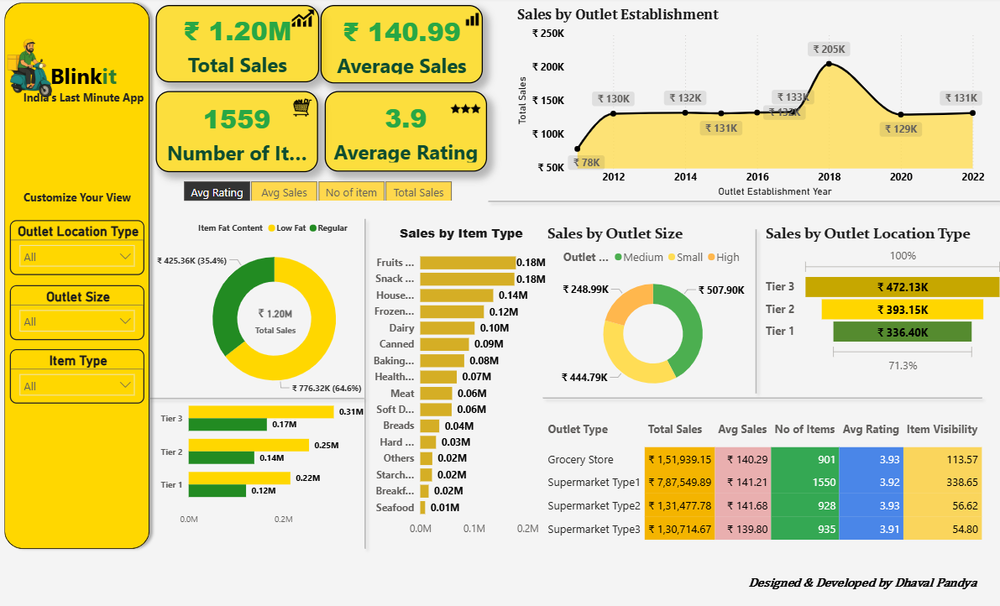

# Blinkit-Sales-Analytics
Interactive Power BI dashboard analyzing FMCG sales trends, outlets, and product performance.

# 📊 Blinkit Sales Analytics Dashboard

## 📂 Project Overview
This repository contains a **Power BI dashboard** built using BlinkIT grocery sales data.  
The goal of this project is to provide clear and interactive insights into sales, profit, and performance across outlets, item types, and categories.  

The dashboard is designed with a modern UI, gradient KPI cards, and smooth interactions for data exploration.

---

## 🗂 Files in this Repository

| File Name | Description |
|-----------|-------------|
| **BlinkIT Grocery Data (1).xlsx** | Raw dataset containing sales, item, and outlet details used for building the dashboard. |
| **Blinkit_Sales_Analytics.pbix** | Complete Power BI dashboard with all visuals, slicers, and formatting applied. |
| **BlinkItSales_Dashboard.png** | Static screenshot preview of the final interactive dashboard. |

---

## 📌 Features of the Dashboard
- **KPI Cards** with gradient backgrounds and left-accent bars for Total Sales, Average Sales, FAT %, and Total Profit.  
- **Interactive Slicer Tabs** for filtering by outlet size, item type, and other categories.  
- **Donut Charts** for sales distribution by item type.  
- **Bar & Column Charts** for outlet-level performance and FAT % comparison.  
- **Funnel Chart** to visualize sales flow.  
- **Formatted Table** with color-coded rows for detailed data insights.  
- **Custom Theme & Styling** to replicate a BlinkIT-like visual experience.  

---

## 📷 Dashboard Preview

---

## 📊 Data Insights Summary
Based on the analysis of BlinkIT grocery data:
- **Outlet Performance:** Medium-sized outlets lead in sales performance overall.  
- **Item Type Contribution:** Fruits & Vegetables and Snack Foods have the highest sales share, followed by Dairy products.  
- **FAT Percentage:** Low-fat items contribute a significant portion of sales, but regular items remain competitive.  
- **Profitability:** A small number of outlets contribute disproportionately to total profits, suggesting scaling potential.  
- **Sales Funnel:** The drop from total orders to completed sales reveals conversion efficiency.

---

## 🚀 How to Use
1. Download both the `.pbix` file and the `.xlsx` file.  
2. Open `Blinkit_Sales_Analytics.pbix` in **Power BI Desktop**.  
3. Ensure the data source is linked to **BlinkIT Grocery Data (1).xlsx**.  
4. Interact with slicers, charts, and KPI cards to explore insights.

---

## 👨‍💻 Author
**Dhaval Pandya** — Creator of the Blinkit Sales Analytics Dashboard

